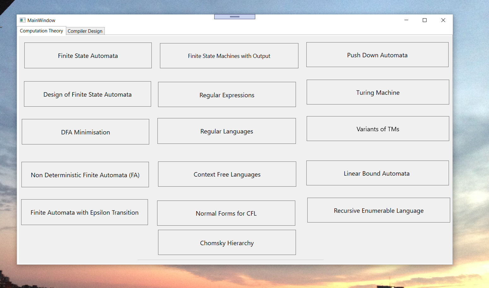
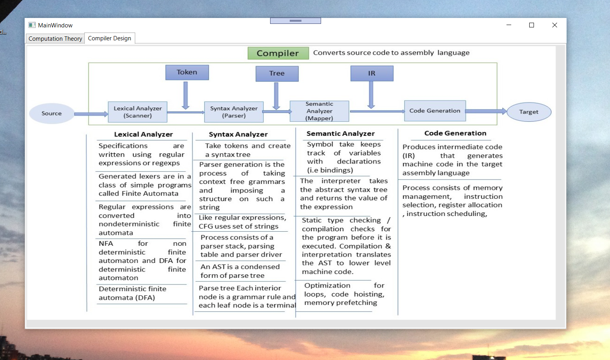
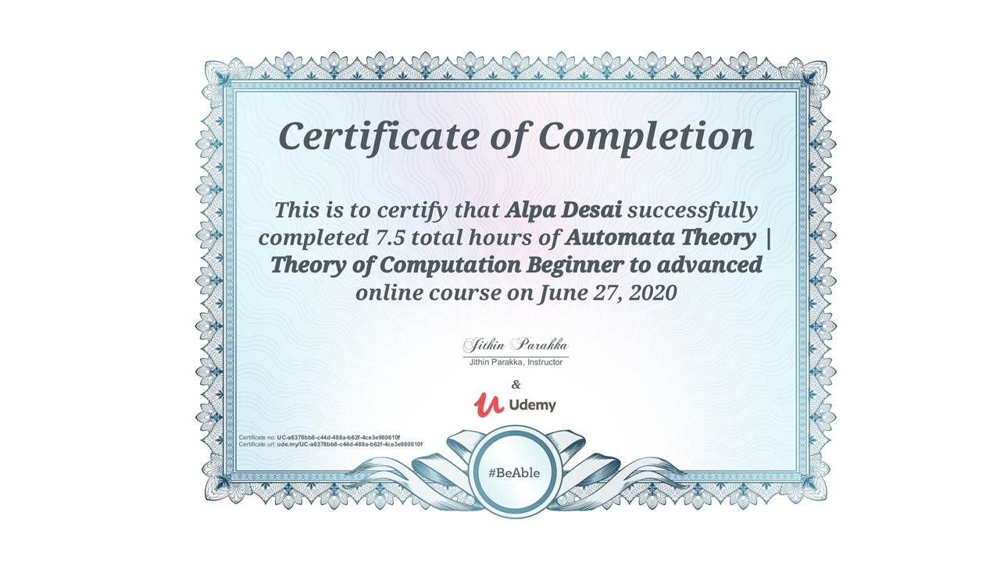
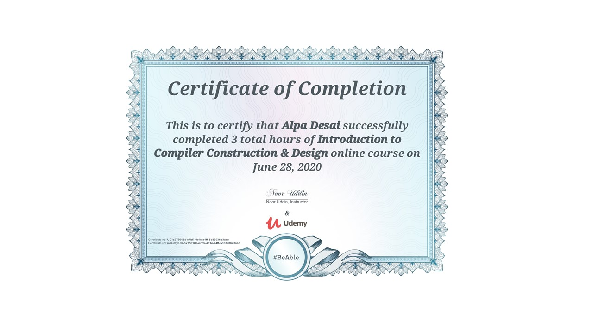

# Compiler Design

The project provides an overview of introduction to compiler design, automata & computation theory. 

Confidential information is not displayed.  

Reference: Building your own compiler with C++ - Jim Holmes

Advanced knowledge reference : https://github.com/alpaddesai/ObjectOrientedDesignProgramming

