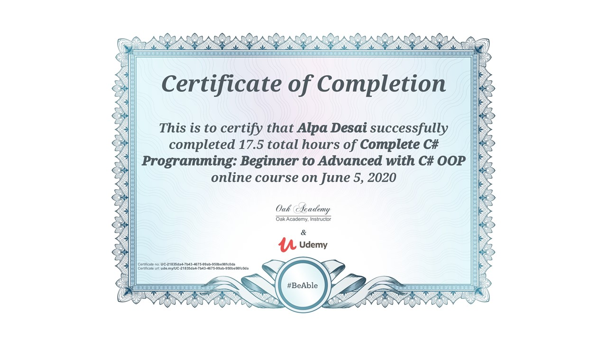

# Introduction to  Compiler Design and Automata Theory

The project provides an overview of introduction to compiler design, automata & computation theory. 

Confidential information is not displayed.  

Advanced knowledge reference : https://github.com/alpaddesai/SoftwareEngineering

